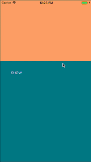

# WIZTutorialPagerController

- create your own tutorial pages with your images, descriptions and buttons
- handle button presses

HOW TO INSTALL

Import files from the folder "WIZTutorialPagerController Obj-C" to your project. 

HOW TO USE

**Use custom object**

1. Create array with *WIZTutorialObject*. For example:

~~~~
NSMutableArray *tutorialObjects = [NSMutableArray arrayWithCapacity:0];
[tutorialObjects addObject:[[WIZTutorialObject alloc] initWithImage:[UIImage imageNamed:@"001"] description:@"Description # 1" btnText:@"Tap me"]];
[tutorialObjects addObject:[[WIZTutorialObject alloc] initWithImage:[UIImage imageNamed:@"002"] description:@"Description # 2" btnText:@"Tap me"]];
[tutorialObjects addObject:[[WIZTutorialObject alloc] initWithImage:[UIImage imageNamed:@"003"] description:@"Description # 3" btnText:@"What is it?"]];
[tutorialObjects addObject:[[WIZTutorialObject alloc] initWithImage:[UIImage imageNamed:@"004"] description:@"Description # 4" btnText:@"SKIP"]];
~~~~

2. When you initialize *WIZTutorialPagerController* you'll have to implement delegate and set tutorialObjects' array.
For example:

~~~~
WIZTutorialPagerController* controller = [[WIZTutorialPagerController alloc] init];
controller.modalPresentationStyle = UIModalPresentationCurrentContext;
controller.tutorialObjects = tutorialObjects;
controller.delegate = self;
[self presentViewController:controller animated:YES completion:nil];
~~~~

3. Use *WIZTutorialPagerControllerDelegate*

*-(void)WIZTutorialPagerController:(WIZTutorialPagerController \*)controller tapBtnWithIndex:(NSInteger)index*

It return index button was tapped

4. It's all. You can use this controller.